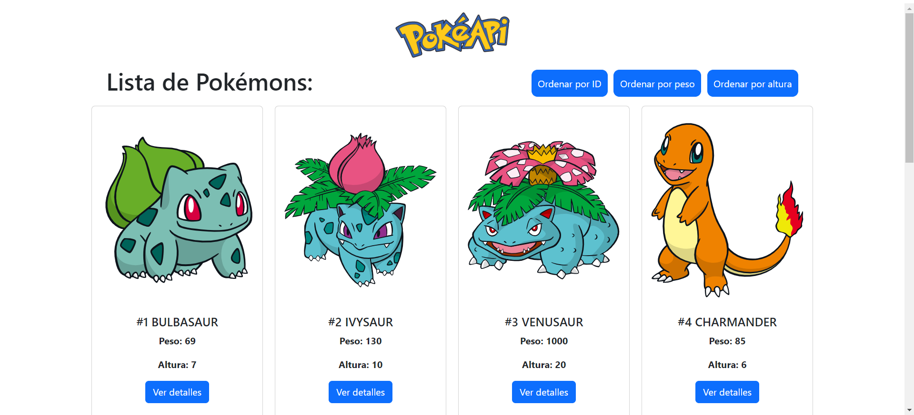

# PokeAPI

Este es un proyecto básico para la utilización de la PokéAPI. La aplicación permite ver una lista de los primeros 10 pokémons disponibles con su imagen, nombre, peso, número y altura. Al hacer click sobre un pokémon, obtienes todos los detalles del pokémon seleccionado.

## Tecnologías utilizadas

- Vite
- React
- Librerías de React:
  - Router dom
  - Scroll to top
- Framer motion

## Funcionalidades

- Ver una lista de 10 pokémons disponibles
- Se permite ordenar la lista por peso, número o altura, de forma ascendente o descendente

## Instalación

### Para instalar y ejecutar la aplicación en tu máquina local, sigue los siguientes pasos:

1. Clona el repositorio a tu máquina local.
2. Abre una terminal en el directorio del proyecto.
3. Ejecuta el comando npm install para instalar las dependencias.
4. Ejecuta el comando npm run dev para iniciar la aplicación.
5. Abre tu navegador y navega a http://localhost:5173 para ver la aplicación en acción.

## Hola!👋

¡Gracias por ingresar a mi proyecto! Soy Jorgelina Mariano, programadora Frontend y estudiante de Backend. Espero que hayas encontrado útil este código.

Si tienes alguna pregunta, no dudes en contactarme a mis redes 😊

## 📄 Licencia

Este proyecto está licenciado bajo la Licencia MIT. Consulta el archivo LICENSE para obtener más información.
